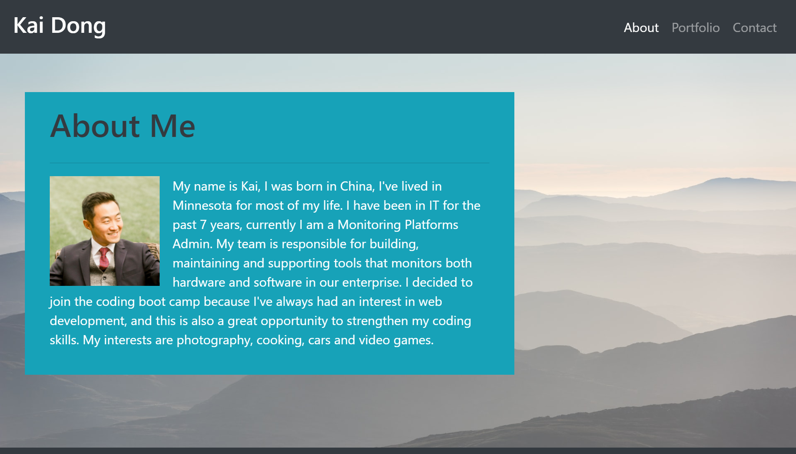
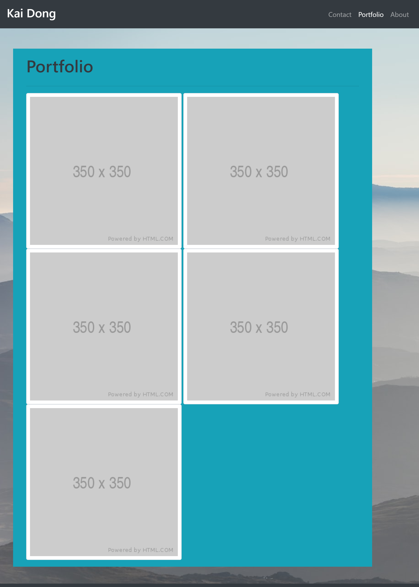
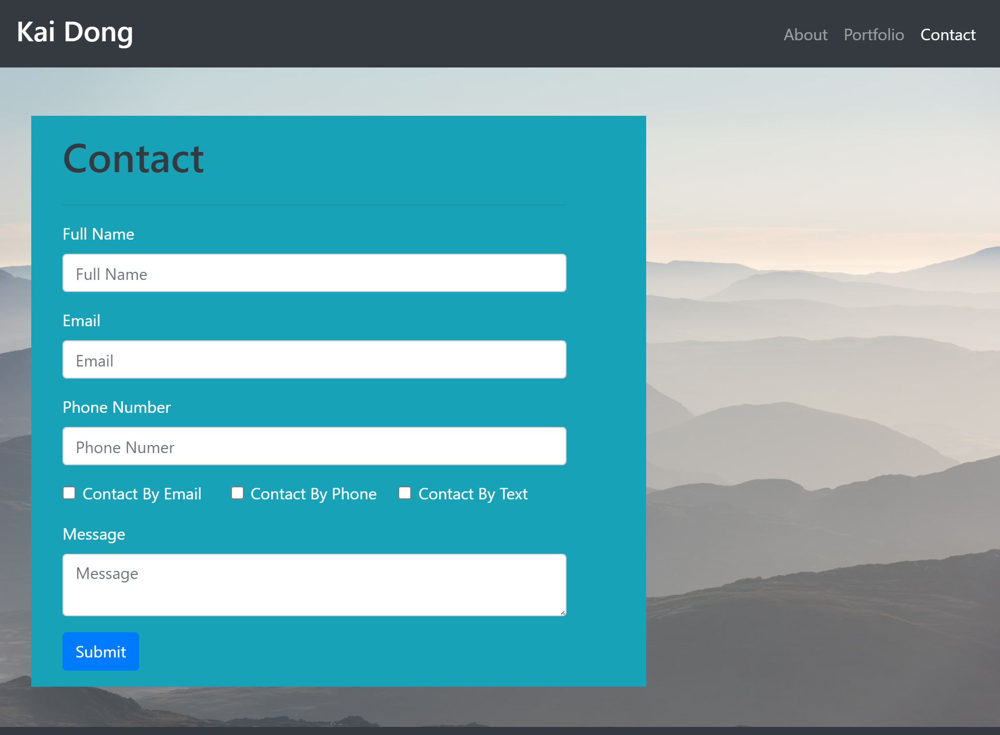
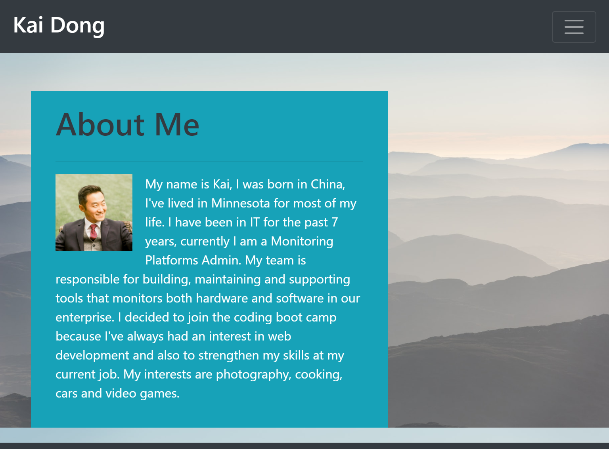
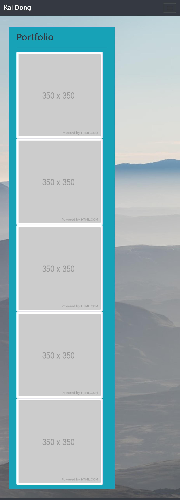
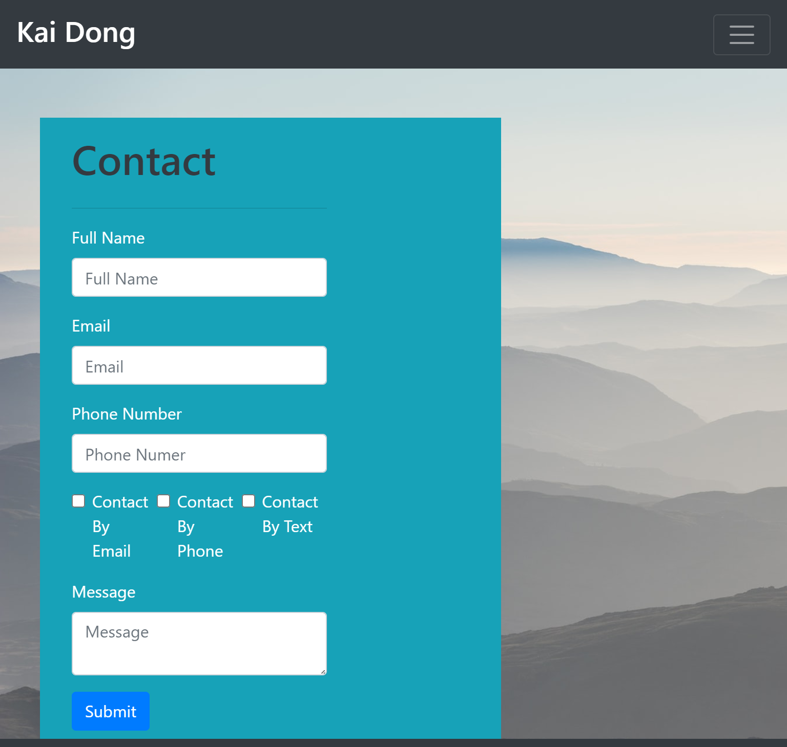
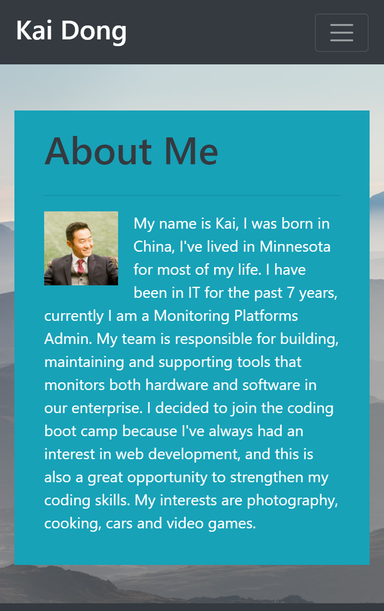
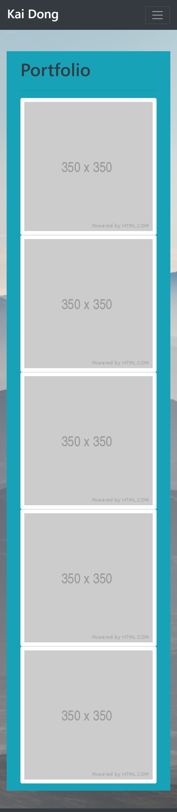
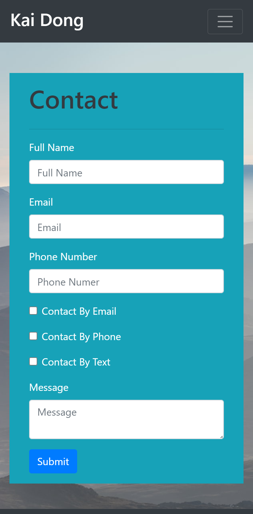

# Responsive Portfolio

### Overview
Utilize bootstrap as the main source of CSS to create a responsive portfolio page, with minimal usage of media queries.

### Implementation
* Utilize semantic elements in HTML
* Use bootstrap to style portfolio, include usage of navbar, sticky footer, forms, grids and rows.
* Use bootstrap's column sizing to minmize media query usage
* Validate HTML with W3C Validator Service to ensure there are no errors.

[Portoflio Webpage Link](https://kaidong-chr.github.io/HW2_Responsive_Portfolio/)

### Responsive Screenshots

At 992px

 
 
At 768px

 
 
At 400px

 

### Installation

Prefered application and version controlled system.
* Visual Studio Code - https://code.visualstudio.com/download
* Git - https://git-scm.com/downloads

### Contributing

To contribute clone from the repo.
You can also fork or download from the repo, if you prefer to view or edit this in your own space.

### Credits

* Trilogy Education Services
* W3Schools
* Bootstrap

### License

Copyright © 2020 Kai Dong